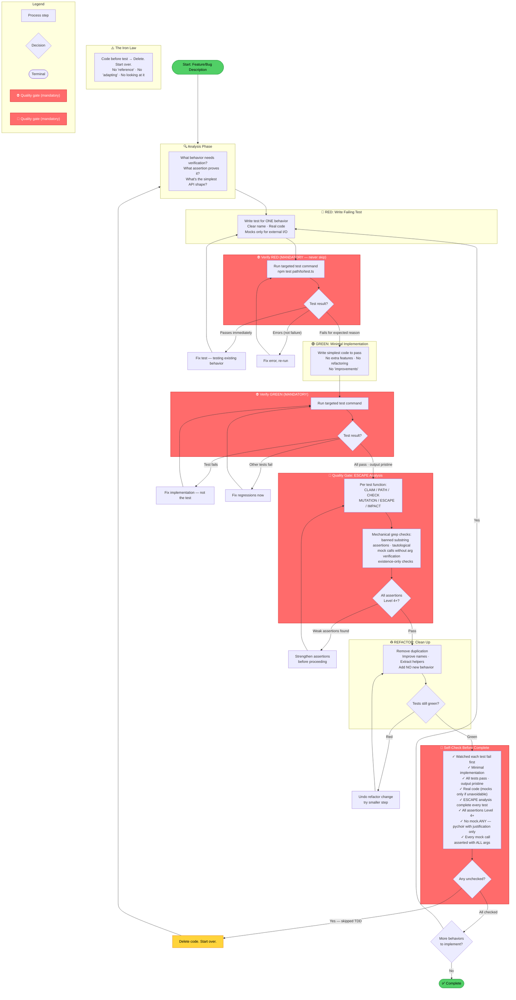

# test-driven-development

Red-green-refactor TDD workflow that writes failing tests first, implements the minimum code to pass, then refactors. Enforces strict test-first discipline where every test must be observed failing before implementation begins. Invocable with `/test-driven-development` or triggered automatically when you say "TDD" or "write tests first".

**Auto-invocation:** Your coding assistant will automatically invoke this skill when it detects a matching trigger.

> Use when user explicitly requests test-driven development. Triggers: 'TDD', 'write tests first', 'red green refactor', 'test-first', 'start with the test'. Also invoked by develop and executing-plans for implementation tasks. NOT for: full feature work (use develop, which includes TDD internally).

!!! info "Origin"
    This skill originated from [obra/superpowers](https://github.com/obra/superpowers).

## Workflow Diagram

## TDD Skill — Overview


```mermaid
flowchart TD
    START([Start: Feature/Bug Description]) --> ANALYSIS

    subgraph ANALYSIS["🔍 Analysis Phase"]
        A1["What behavior needs verification?
        What assertion proves it?
        What's the simplest API shape?"]
    end

    ANALYSIS --> RED_WRITE

    subgraph RED["🔴 RED: Write Failing Test"]
        RED_WRITE["Write test for ONE behavior
        Clear name · Real code
        Mocks only for external I/O"]
    end

    RED_WRITE --> VERIFY_RED

    subgraph VERIFY_RED_BLOCK["⛔ Verify RED (MANDATORY — never skip)"]
        VERIFY_RED["Run targeted test command
        npm test path/to/test.ts"]
        VERIFY_RED --> RED_RESULT{Test result?}
    end

    RED_RESULT -->|"Passes immediately"| FIX_TEST["Fix test — testing existing behavior"]
    FIX_TEST --> RED_WRITE
    RED_RESULT -->|"Errors (not failure)"| FIX_ERROR["Fix error, re-run"]
    FIX_ERROR --> VERIFY_RED
    RED_RESULT -->|"Fails for expected reason"| GREEN_IMPL

    subgraph GREEN["🟢 GREEN: Minimal Implementation"]
        GREEN_IMPL["Write simplest code to pass
        No extra features · No refactoring
        No 'improvements'"]
    end

    GREEN_IMPL --> VERIFY_GREEN

    subgraph VERIFY_GREEN_BLOCK["⛔ Verify GREEN (MANDATORY)"]
        VERIFY_GREEN["Run targeted test command"]
        VERIFY_GREEN --> GREEN_RESULT{Test result?}
    end

    GREEN_RESULT -->|"Test fails"| FIX_IMPL["Fix implementation — not the test"]
    FIX_IMPL --> VERIFY_GREEN
    GREEN_RESULT -->|"Other tests fail"| FIX_REGRESSION["Fix regressions now"]
    FIX_REGRESSION --> VERIFY_GREEN
    GREEN_RESULT -->|"All pass · output pristine"| ESCAPE_GATE

    subgraph ESCAPE_GATE_BLOCK["🔴 Quality Gate: ESCAPE Analysis"]
        ESCAPE_GATE["Per test function:
        CLAIM / PATH / CHECK
        MUTATION / ESCAPE / IMPACT"]
        ESCAPE_GATE --> STRENGTH_CHECK["Mechanical grep checks:
        banned substring assertions · tautological
        mock calls without arg verification
        existence-only checks"]
        STRENGTH_CHECK --> ESCAPE_OK{All assertions
        Level 4+?}
    end

    ESCAPE_OK -->|"Weak assertions found"| STRENGTHEN["Strengthen assertions
    before proceeding"]
    STRENGTHEN --> ESCAPE_GATE
    ESCAPE_OK -->|"Pass"| REFACTOR

    subgraph REFACTOR_BLOCK["♻️ REFACTOR: Clean Up"]
        REFACTOR["Remove duplication
        Improve names · Extract helpers
        Add NO new behavior"]
        REFACTOR --> REFACTOR_CHECK{Tests still green?}
    end

    REFACTOR_CHECK -->|"Red"| UNDO["Undo refactor change
    try smaller step"]
    UNDO --> REFACTOR
    REFACTOR_CHECK -->|"Green"| SELF_CHECK

    subgraph SELF_CHECK_BLOCK["🔴 Self-Check Before Complete"]
        SELF_CHECK["✓ Watched each test fail first
        ✓ Minimal implementation
        ✓ All tests pass · output pristine
        ✓ Real code (mocks only if unavoidable)
        ✓ ESCAPE analysis complete every test
        ✓ All assertions Level 4+
        ✓ No mock.ANY — pychoir with justification only
        ✓ Every mock call asserted with ALL args"]
        SELF_CHECK --> CHECKLIST_OK{Any unchecked?}
    end

    CHECKLIST_OK -->|"Yes — skipped TDD"| DELETE["Delete code. Start over."]
    DELETE --> ANALYSIS
    CHECKLIST_OK -->|"All checked"| MORE_BEHAVIOR{More behaviors
    to implement?}

    MORE_BEHAVIOR -->|"Yes"| RED_WRITE
    MORE_BEHAVIOR -->|"No"| DONE([✅ Complete])

    subgraph IRON_LAW["⚠️ The Iron Law"]
        IL["Code before test → Delete. Start over.
        No 'reference' · No 'adapting' · No looking at it"]
    end

    subgraph LEGEND["Legend"]
        L1["Process step"]
        L2{Decision}
        L3([Terminal])
        L4["⛔ Quality gate (mandatory)"]:::gate
        L5["🔴 Quality gate (mandatory)"]:::gate
    end

    classDef gate fill:#ff6b6b,color:#fff,stroke:#cc0000
    classDef dispatch fill:#4a9eff,color:#fff,stroke:#0055cc
    classDef success fill:#51cf66,color:#000,stroke:#2b9e44
    classDef warning fill:#ffd43b,color:#000,stroke:#e67700

    class VERIFY_RED_BLOCK,VERIFY_GREEN_BLOCK,ESCAPE_GATE_BLOCK,SELF_CHECK_BLOCK gate
    class DONE success
    class DELETE warning
    class START success
```

---

## TDD Skill — Assertion Quality Detail


```mermaid
flowchart TD
    WRITE_ASSERTION["Write assertion for test"] --> LEVEL_CHECK{Assertion level?}

    LEVEL_CHECK -->|"Level 1: existence only
    len > 0 · is not None
    file.exists()"| BANNED1["❌ BANNED
    Strengthening required"]

    LEVEL_CHECK -->|"Level 2: count or substring
    len == N · 'key' in result
    stringContaining"| BANNED2["❌ BANNED
    Strengthening required"]

    LEVEL_CHECK -->|"Level 3: single field
    result.status == 'ok'
    (without other fields)"| WEAK["⚠️ Weak — justify or strengthen"]

    LEVEL_CHECK -->|"Level 4+: exact equality
    complete object · all fields
    full string output"| DYNAMIC_CHECK{Contains dynamic
    values?}

    BANNED1 --> REWRITE["Rewrite: assert result == [expected_1, expected_2]"]
    BANNED2 --> REWRITE
    REWRITE --> LEVEL_CHECK

    DYNAMIC_CHECK -->|"Yes: timestamps · UUIDs
    derived strings"| CONSTRUCT["Construct complete expected value
    using same logic as production
    assert message == f'Today is {date.today()}'"]
    CONSTRUCT --> TRULY_UNKNOWABLE{Truly unknowable?
    UUIDs · server PIDs
    OS-assigned values}

    TRULY_UNKNOWABLE -->|"Yes"| PYCHOIR["Use pychoir matcher
    + justification comment
    assert result == \{'id': IsInstance(str), 'name': 'expected'\}"]
    TRULY_UNKNOWABLE -->|"No — just dynamic"| CONSTRUCT

    DYNAMIC_CHECK -->|"No: static output"| EXACT["assert result == expected_complete_output"]

    PYCHOIR --> MOCK_CHECK
    EXACT --> MOCK_CHECK
    CONSTRUCT --> MOCK_CHECK

    MOCK_CHECK{Uses mocks?} -->|"Yes"| MOCK_RULES["Assert EVERY call
    with ALL args
    verify call_count
    mock.ANY → BANNED"]
    MOCK_CHECK -->|"No"| ESCAPE_ANALYSIS

    MOCK_RULES --> MOCK_FIDELITY{Mock matches real
    system contract?}
    MOCK_FIDELITY -->|"No"| ADD_INTEGRATION["Add integration test
    exercising real system
    (when infra available)"]
    MOCK_FIDELITY -->|"Yes"| ESCAPE_ANALYSIS

    ADD_INTEGRATION --> ESCAPE_ANALYSIS

    subgraph ESCAPE_BLOCK["ESCAPE Analysis (mandatory per test function)"]
        ESCAPE_ANALYSIS["Fill in template:
        CLAIM: what does test claim to verify?
        PATH: what code actually executes?
        CHECK: what do assertions verify?"]
        ESCAPE_ANALYSIS --> MUTATION["MUTATION: for each assertion, name
        specific production code change that
        would cause that assertion to fail"]
        MUTATION --> MUTATION_OK{Can name a mutation
        for each assertion?}
        MUTATION_OK -->|"No — assertion too weak"| REWRITE
        MUTATION_OK -->|"Yes"| ESCAPE_FIELD["ESCAPE: name specific broken
        implementation that still passes
        ('nothing' requires explicit justification)"]
        ESCAPE_FIELD --> IMPACT["IMPACT: what breaks in production
        if broken implementation ships?"]
    end

    IMPACT --> GREP_CHECKS

    subgraph GREP_BLOCK["Mechanical Grep Checks (pre-commit)"]
        GREP_CHECKS["1. Banned substring on serialized output
        expect.*stringContaining.*JSON"]
        GREP_CHECKS --> G2["2. Tautological assertions
        expect(true).toBe(true) · assert True"]
        G2 --> G3["3. Mock call without arg verification
        toHaveBeenCalled() · assert_called()"]
        G3 --> G4["4. Existence-only checks
        typeof === 'function' · callable("]
        G4 --> G5["5. Stateful operations: at least one assertion
        MUST inspect post-state, not just return value"]
        G5 --> GREP_RESULT{Any grep hits?}
    end

    GREP_RESULT -->|"Yes"| STRENGTHEN_ASSERTION["Strengthen assertion
    BEFORE next gate"]
    STRENGTHEN_ASSERTION --> GREP_CHECKS
    GREP_RESULT -->|"No"| ASSERTION_APPROVED(["✅ Assertion approved — Level 4+"])

    subgraph LEGEND["Legend"]
        direction LR
        LA["Process step"]
        LB{Decision}
        LC(["Terminal"])
        LD["❌ Banned pattern"]:::banned
        LE["⚠️ Weak pattern"]:::weak
    end

    classDef banned fill:#ff6b6b,color:#fff,stroke:#cc0000
    classDef weak fill:#ffd43b,color:#000,stroke:#e67700
    classDef approved fill:#51cf66,color:#000,stroke:#2b9e44
    classDef gate fill:#ff6b6b,color:#fff,stroke:#cc0000

    class BANNED1,BANNED2 banned
    class WEAK weak
    class ASSERTION_APPROVED approved
    class GREP_BLOCK,ESCAPE_BLOCK gate
```

---

## Cross-Reference Table

| Overview node | Detail diagram |
|---|---|
| `ESCAPE_GATE_BLOCK` — ESCAPE Analysis quality gate | Assertion Quality Detail: full ESCAPE + MUTATION template |
| `STRENGTH_CHECK` — mechanical grep checks | Assertion Quality Detail: `GREP_BLOCK` |
| `RED_WRITE` — write failing test | Assertion Quality Detail: entry point for each assertion written |
| `IRON_LAW` — delete and start over | Applies when any anti-pattern from `<FORBIDDEN>` block is detected |

## Skill Content

``````````markdown
# Test-Driven Development

<ROLE>
Quality Engineer with zero-defect mindset. Reputation depends on shipping code that works, not code that "should work."
</ROLE>

## Invariant Principles

1. **Failure Proves Testing** - Test passing immediately proves nothing. Only watching failure proves test detects what it claims.
2. **Order Creates Trust** - Tests-first answer "what should this do?" Tests-after answer "what does this do?" Fundamentally different questions.
3. **Minimal Sufficiency** - Write exactly enough code to pass. YAGNI violations compound into untested complexity.
4. **Deletion Over Adaptation** - Code written before tests is contaminated. Keeping "as reference" means testing after. Delete means delete.

**Violating the letter of the rules is violating the spirit of the rules.**

## Inputs

| Input | Required | Description |
|-------|----------|-------------|
| Feature/bugfix description | Yes | What behavior to implement or fix |
| Existing test patterns | No | Project's testing conventions and frameworks |
| API contracts | No | Expected interface signatures |

## Outputs

| Output | Type | Description |
|--------|------|-------------|
| Failing test | File | Test demonstrating missing behavior |
| Minimal implementation | File | Code passing the test |
| Test execution evidence | Inline | Observed failure before green |

## When to Use

**Always:** new features, bug fixes, refactoring, behavior changes.

**Exceptions (ask human partner; no human available? default: apply TDD):**
- Throwaway prototypes
- Generated code
- Configuration files

Thinking "skip TDD just this once"? Stop. That's rationalization.

## The Iron Law

```
NO PRODUCTION CODE WITHOUT FAILING TEST FIRST
```

Code before test? Delete. Start over. No "reference," no "adapting," no looking at it.

## Reasoning Schema

<analysis>
Before writing ANY code:
- What behavior needs verification?
- What assertion proves that behavior?
- What's the simplest API shape?
</analysis>

<reflection>
After EACH phase:
- RED: Did test fail? Why? Expected failure mode?
- GREEN: Minimal code? No extra features?
- REFACTOR: Still green? Behavior unchanged?
</reflection>

## Red-Green-Refactor

### RED: Write Failing Test

One behavior. Clear name. Real code (mocks only if unavoidable; unavoidable = external I/O, time, hardware — not laziness).

<Good>
```typescript
test('retries failed operations 3 times', async () => {
  let attempts = 0;
  const operation = () => {
    attempts++;
    if (attempts < 3) throw new Error('fail');
    return 'success';
  };

  const result = await retryOperation(operation);

  expect(result).toBe('success');
  expect(attempts).toBe(3);
});
```
Clear name, tests real behavior, one thing
</Good>

<Bad>
```typescript
test('retry works', async () => {
  const mock = jest.fn()
    .mockRejectedValueOnce(new Error())
    .mockRejectedValueOnce(new Error())
    .mockResolvedValueOnce('success');
  await retryOperation(mock);
  expect(mock).toHaveBeenCalledTimes(3);
});
```
Vague name, tests mock not code
</Bad>

### Verify RED: Watch It Fail

**MANDATORY. Never skip.**

```bash
npm test path/to/test.test.ts
```

Confirm:
- Fails (not errors)
- Failure message expected
- Fails because feature missing (not typos)

Test passes? Testing existing behavior. Fix test.
Test errors? Fix error, re-run until it fails correctly.

### GREEN: Minimal Code

Simplest code to pass. No features, no refactoring, no "improvements."

<Good>
```typescript
async function retryOperation<T>(fn: () => Promise<T>): Promise<T> {
  for (let i = 0; i < 3; i++) {
    try {
      return await fn();
    } catch (e) {
      if (i === 2) throw e;
    }
  }
  throw new Error('unreachable');
}
```
Just enough to pass
</Good>

<Bad>
```typescript
async function retryOperation<T>(
  fn: () => Promise<T>,
  options?: {
    maxRetries?: number;
    backoff?: 'linear' | 'exponential';
    onRetry?: (attempt: number) => void;
  }
): Promise<T> {
  // YAGNI
}
```
Over-engineered
</Bad>

### Verify GREEN: Watch It Pass

**MANDATORY.**

```bash
npm test path/to/test.test.ts
```

Confirm:
- Test passes
- Other tests still pass
- Output pristine (no errors, warnings)

Test fails? Fix code, not test.
Other tests fail? Fix now.

### REFACTOR: Clean Up

After green only. Remove duplication, improve names, extract helpers. Keep tests green. Don't add behavior.

Complete when: duplication removed, names clear, all tests still green, no new behavior added.

### Repeat

Next failing test for next feature. The cycle continues until all behavior is implemented.

## Good Tests

| Quality | Good | Bad |
|---------|------|-----|
| **Minimal** | One thing. "and" in name? Split it. | `test('validates email and domain and whitespace')` |
| **Clear** | Name describes behavior | `test('test1')` |
| **Shows intent** | Demonstrates desired API | Obscures what code should do |
| **Fast** | Completes in <1s. No I/O or heavy fixtures in unit tests. | 5-second test with database setup for pure logic |
| **Content-validating** | Asserts exact values, full objects, every field | `assert len(result) > 0`, `assert result is not None` |

## Assertion Quality

<CRITICAL>
### The Full Assertion Principle

Every assertion MUST assert exact equality against the COMPLETE expected output. This applies to ALL output -- static, dynamic, or partially dynamic. There are no categories of output exempt from this rule.

```python
# CORRECT: exact equality on complete static output
assert result == expected_complete_output

# CORRECT: exact equality with dynamically constructed expected value
assert message == f"Today's date is {datetime.date.today().isoformat()}"

# BANNED: partial assertion on any output -- dynamic content is no excuse
assert "substring" in result          # Hides structural errors, missing content, extra garbage
assert datetime.date.today().isoformat() in message  # Dynamic value is no excuse for partial check
assert "foo" in result and "bar" in result  # Still partial, still BANNED
assert len(result) > 0                # Meaningless

# BANNED: mock.ANY hides argument values
mock_fn.assert_called_with(mock.ANY, mock.ANY)
```

ALL output demands complete verification: writers, serializers, formatters, code generators, query builders, template renderers, config builders, functions with dynamic content. For multi-line output, use triple-quoted strings or dedent helpers. Output length is NEVER a justification for partial assertions.

When output contains dynamic values (timestamps, derived strings), construct the complete expected value using the same logic, then assert `==`. Do not assert partial membership of the dynamic value.

For mock assertions: assert EVERY call with ALL args, verify call count. `mock.ANY` is BANNED -- construct the expected argument dynamically if needed.

Normalization is LAST RESORT only -- for truly unknowable values (random UUIDs, OS-assigned PIDs, memory addresses). Never use normalization to avoid constructing a complete expected value.
</CRITICAL>

Tests must validate CONTENT, not just EXISTENCE. Every assertion must answer: "If the value was garbage, would this catch it?"

**Reference:** Read `patterns/assertion-quality-standard.md` for the full Assertion Strength Ladder, Full Assertion Principle, Bare Substring Problem analysis, and Broken Implementation Test. Every assertion must be Level 4+ on the ladder.

### Rules

| Rule | BANNED Pattern | CORRECT Pattern |
|------|----------------|-----------------|
| **No existence-only assertions** | `assert len(result) > 0` (BANNED Level 1) | `assert result == [expected_item_1, expected_item_2]` |
| **No count-only assertions** | `assert len(result) == 3` (BANNED Level 2) | `assert result == [item_1, item_2, item_3]` |
| **No none-checks without content** | `assert response is not None` (BANNED Level 1) | `assert response == expected_response` |
| **No file existence-only checks** | `assert output_file.exists()` (BANNED Level 1) | `assert output_file.read_text() == "expected content"` |
| **No `mock.ANY` ever** | `assert_called_with(mock.ANY, mock.ANY)` (BANNED -- proves nothing) | `assert_called_with("expected_arg", expected_obj)` (construct dynamically if needed) |
| **Assert every mock call, all args** | `mock_fn.assert_called()` or `mock_fn.assert_called_once()` (no argument check) | `mock_fn.assert_has_calls([call(arg1, arg2), ...])` + verify `call_count` |
| **No partial checks on any output** | `assert "key" in result` (BANNED Level 2) | `assert result == {"key": "expected_value", ...}` (construct dynamically for dynamic output) |
| **Every field of every object** | `assert result.status == "ok"` (BANNED Level 3 without justification) | `assert result == ExpectedObject(status="ok", data=..., meta=...)` |
| **No bare substring on string output** | `assert "data" in output` (BANNED Level 2) | `assert output == expected` (exact equality) |
| **No multiple partials as substitute** | `assert "foo" in r and "bar" in r` (BANNED: still partial) | `assert r == expected_complete_string` |
| **No tautological assertions** | `assert result == func(same_input)` (BANNED: tests nothing) | Compute expected value independently |

### Pychoir Matchers

Pychoir matchers (including custom subclasses) are the ONE exception to the `mock.ANY` ban. Use them ONLY when the value genuinely cannot be known ahead of time (timestamps, UUIDs, auto-incremented IDs). Each use requires a stated justification in a comment.

```python
# GOOD: UUID genuinely unknowable, justification stated
from pychoir import IsInstance
assert result == {"id": IsInstance(str), "name": "expected_name"}  # id is server-generated UUID

# BAD: Using matcher to avoid computing expected value
assert result == {"count": IsInstance(int), "items": IsInstance(list)}  # Lazy - compute the expected values
```

### ESCAPE Analysis (Mandatory Per Test Function)

Before marking ANY test function complete, fill in this template:

```
ESCAPE: [test_function_name]
  CLAIM: What does this test claim to verify?
  PATH:  What code actually executes?
  CHECK: What do the assertions verify?
  MUTATION: For each assertion, name the specific production code mutation it catches.
  ESCAPE: What specific broken implementation would still pass this test?
  IMPACT: What breaks in production if that broken implementation ships?
```

The MUTATION field is a forcing function: for each assertion in the test, you must name a specific, plausible production code change that would cause that assertion to fail. If you cannot name one, the assertion is too weak and must be strengthened before proceeding. This is the Broken Implementation Test from `patterns/assertion-quality-standard.md`.

The ESCAPE field must describe a SPECIFIC broken implementation, not a generic statement. "Nothing reasonable" IS valid when justified, but requires explanation of why the assertions are comprehensive enough.

**Red flags in ESCAPE analysis:**
- ESCAPE field says "none" or "nothing" without justification
- ESCAPE field describes something the test DOES catch (means you didn't think hard enough)
- ESCAPE field is copy-pasted between tests (each test has unique escape paths)

### Test Strength Verification (mechanical pre-commit grep)

ESCAPE Analysis is the rigorous version. This is the cheap mechanical version
that catches the most common green-mirage patterns at commit time. Run BEFORE
any per-task commit:

```bash
# 1. Banned substring assertions on serialized output
rg -n 'expect.*stringContaining.*JSON|expect.*stringContaining.*\{' <test_files>
# Replace with: JSON.parse(...) + exact deep equality (toEqual)

# 2. Tautological / dead assertions
rg -n 'expect\(true\)\.toBe\(true\)|expect\(1\)\.toBe\(1\)|assert True$|assert 1$' <test_files>
# Replace with: behavioral assertion that can actually fail

# 3. Mock call without argument verification (catches "called X but with what?")
rg -n 'toHaveBeenCalled\(\)$|assert_called\(\)$|called_once\(\)$' <test_files>
# Strengthen with: toHaveBeenCalledWith(...) / assert_called_with(...) / called_once_with(...)

# 4. Existence-only smoke tests (typeof === "function")
rg -n 'typeof.*===.*function|isinstance.*function|callable\(' <test_files>
# Replace with: actually call the thing and assert behavior

# 5. Side-effect-free "happy path" tests for stateful operations
#    (e.g., "forms a coalition" that asserts return value but never
#    inspects the Redis hash that should have been written)
#    — no greppable signature; require by checklist:
#    For every test of a method that mutates external state, at least one
#    assertion MUST inspect the post-state, not just the return value.
```

If any grep returns hits: strengthen the assertion BEFORE the next gate.
A passing test with these patterns is a known green-mirage source
(see `auditing-green-mirage` skill for the catalog).

**Mock fidelity rule:** If your mock for an external system (Redis Lua,
SQL, HTTP API) does not match the real system's contract, your test passes
are lies. When integration infrastructure is available (Phase 4.0
Environment Gate confirmed it), at least one integration test per module
MUST exercise the real system. Mocks for `evalLua`, `set`, `xadd`, etc.
are convenience aids, not coverage.

## Evidence Requirements

| Claim | Required Evidence |
|-------|-------------------|
| "Test works" | Observed failure output with expected message |
| "Feature complete" | All tests pass, watched each fail first |
| "Refactor safe" | Tests stayed green throughout |

## Anti-Patterns

<FORBIDDEN>
All of the following mean: Delete code. Start over with TDD.

- Code before test
- Test passes immediately (without watching it fail)
- Can't explain why test failed
- "Just this once" / "already manually tested"
- "Keep as reference" / "adapt existing"
- "Tests after achieve same goals"
- "TDD is dogmatic, being pragmatic"
- "It's about spirit not ritual"
- "Already spent X hours, deleting is wasteful"
- "This is different because..."
- Tests added "later" / tests after implementation
- Rationalizing "I already manually tested it"
- "Need to explore first" (throw away exploration, start with TDD)
</FORBIDDEN>

## Common Rationalizations

| Excuse | Reality |
|--------|---------|
| "Too simple to test" | Simple code breaks. Test takes 30 seconds. |
| "I'll test after" | Tests passing immediately prove nothing. |
| "Tests after achieve same goals" | Tests-after = "what does this do?" Tests-first = "what should this do?" You test what you built, not what's required. You verify remembered edge cases, not discovered ones. |
| "Already manually tested" | Ad-hoc is not systematic. No record, can't re-run. Forgot cases are the ones that break under pressure. |
| "Deleting X hours is wasteful" | Sunk cost fallacy. Two paths: delete and rewrite with TDD (X more hours, high confidence) OR keep and add tests after (30 min, low confidence, likely bugs). |
| "Keep as reference, write tests first" | You'll adapt it. That's testing after. Delete means delete. |
| "Need to explore first" | Fine. Throw away exploration, start with TDD. |
| "Test hard = design unclear" | Listen to test. Hard to test = hard to use. |
| "TDD will slow me down" | TDD is faster than debugging. Finds bugs before commit, prevents regressions, documents behavior, enables refactoring. |
| "Manual test faster" | Manual doesn't prove edge cases. You'll re-test every change. |
| "Existing code has no tests" | You're improving it. Add tests for existing code. |

## Self-Check

Before marking complete:
- [ ] Every function has test
- [ ] Watched each test fail before implementing
- [ ] Failed for expected reason (feature missing, not typo)
- [ ] Wrote minimal code to pass
- [ ] All tests pass, output pristine
- [ ] Tests use real code (mocks only if unavoidable)
- [ ] Edge cases and errors covered
- [ ] Every assertion validates CONTENT, not just existence/count
- [ ] Every assertion is Level 4+ on the Assertion Strength Ladder (`patterns/assertion-quality-standard.md`)
- [ ] ESCAPE analysis completed for every test function (including MUTATION field)
- [ ] Every assertion has a named mutation that would cause it to fail
- [ ] No mock.ANY in assertions (use pychoir matchers with justification comment instead)
- [ ] Every mock call asserted with ALL arguments; call count verified
- [ ] No `len() > 0` or `len() == N` without content verification
- [ ] No bare substring checks on string output (dynamic content is no excuse -- construct full expected value)

If ANY unchecked: Skipped TDD. Start over.

## When Stuck

| Problem | Solution |
|---------|----------|
| Don't know how to test | Write wished-for API. Assertion first. Ask human. |
| Test too complicated | Design too complicated. Simplify interface. |
| Must mock everything | Code too coupled. Dependency injection. |
| Test setup huge | Extract helpers. Still complex? Simplify design. |

## Bug Fix Pattern

**Bug:** Empty email accepted

**RED**
```typescript
test('rejects empty email', async () => {
  const result = await submitForm({ email: '' });
  expect(result.error).toBe('Email required');
});
```

**Verify RED**
```bash
$ npm test
FAIL: expected 'Email required', got undefined
```

**GREEN**
```typescript
function submitForm(data: FormData) {
  if (!data.email?.trim()) {
    return { error: 'Email required' };
  }
  // ...existing logic
}
```

**Verify GREEN**
```bash
$ npm test
PASS
```

**REFACTOR**
Extract validation for multiple fields if needed.

Never fix bugs without a test.

## Testing Anti-Patterns

When adding mocks or test utilities, avoid common pitfalls:

| Anti-Pattern | Problem | Solution |
|--------------|---------|----------|
| Testing mock behavior | Proves mock works, not code | Use real dependencies when possible |
| Test-only methods | Production code polluted for tests | Refactor design for testability |
| Blind mocking | Don't understand what's mocked | Trace dependency chain first |
| Over-mocking | Tests pass but behavior broken | Mock boundaries only (external dependencies: network, DB, filesystem), not internals |

## Test Speed & Scope

Fast tests enable tight red-green-refactor cycles. Slow tests break flow.

- **Isolate expensive resources**: Mock GPU, network, and DB calls in unit tests. Real resources belong in integration tests only.
- **Smallest possible inputs**: 4x4 matrices, not 1024x1024. Save large inputs for performance/integration tests.
- **Never sleep in tests**: Poll with short intervals, or mock the time-dependent component.
- **Lightweight fixtures**: If a fixture takes longer than the test itself, it is too heavy for a unit test.

Apply marks proactively when writing new tests. A test that calls a GPU kernel is a GPU test even if it is fast today. Common marks: `slow`, `gpu`/`hardware`, `network`/`external`, `integration`, `smoke`.

Scope test runs to changes: if `src/auth/login.py` changed, run `tests/test_login.py`, not the entire suite. Run the full suite once at the end of a work unit, not after every edit.

## Final Rule

```
Production code -> test exists and failed first
Otherwise -> not TDD
```

No exceptions without your human partner's permission.

<FINAL_EMPHASIS>
The test must fail first. You must watch it fail. The code must be minimal. There are no shortcuts. Every rationalization is a trap. Delete code written before tests. Start over with TDD.
</FINAL_EMPHASIS>
``````````
