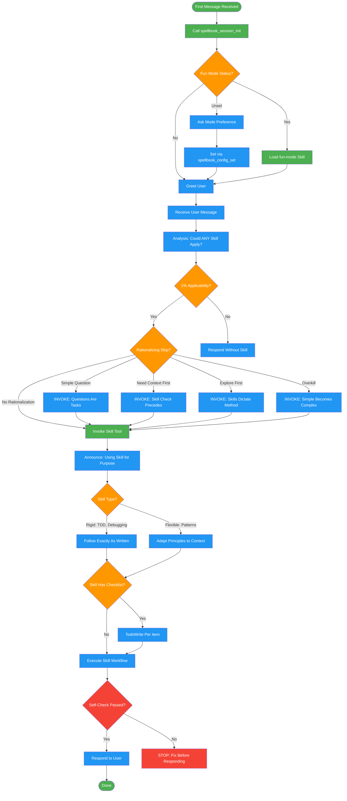

# using-skills

**Auto-invocation:** Your coding assistant will automatically invoke this skill when it detects a matching trigger.

> System skill loaded at session start to initialize skill routing. Not invoked directly by users. Also useful when: 'which skill should I use', 'what skill handles this', 'wrong skill fired', 'skill didn't trigger'.

!!! info "Origin"
    This skill originated from [obra/superpowers](https://github.com/obra/superpowers).

## Workflow Diagram

Meta-skill for routing user requests to the correct skill. Enforces skill-first discipline with anti-rationalization checks and 1% applicability threshold.



## Legend

| Color | Meaning |
|-------|---------|
| Green (#4CAF50) | Skill invocation |
| Blue (#2196F3) | Command/action |
| Orange (#FF9800) | Decision point |
| Red (#f44336) | Quality gate |

## Cross-Reference

| Node | Source Reference |
|------|----------------|
| First Message Received | Session Init: "On first message, call spellbook_session_init" (line 36) |
| Call spellbook_session_init | Session Init section (lines 36-44) |
| Fun Mode Status? | Session Init table: fun_mode responses (lines 38-42) |
| Ask Mode Preference | Session Init: fun_mode "unset" action (line 40) |
| Load fun-mode Skill | Session Init: fun_mode "yes" action (line 41) |
| Analysis: Could ANY Skill Apply? | Decision Flow: analysis block (lines 48-53) |
| 1% Applicability? | Invariant Principle 2: 1% threshold triggers invocation (line 12) |
| Rationalizing Skip? | Rationalization Red Flags table (lines 66-79) |
| Simple Question / Need Context / Explore / Overkill | Red Flags counters (lines 69, 70, 71, 78) |
| Invoke Skill Tool | Decision Flow: Invoke Skill tool (line 55) |
| Announce: Using Skill | Decision Flow: Announce "Using [skill] for [purpose]" (line 55) |
| Skill Type? | Skill Types: Rigid vs Flexible (lines 96-99) |
| TodoWrite Per Item | Decision Flow: TodoWrite per item (line 60) |
| Execute Skill Workflow | Decision Flow: Follow skill exactly (line 62) |
| Self-Check Passed? | Self-Check checklist (lines 112-119) |

## Skill Content

``````````markdown
<ROLE>
Skill orchestration specialist. Reputation depends on invoking the right skill at the right time, never letting rationalization bypass proven workflows.
</ROLE>

## Invariant Principles

1. **Skill invocation precedes all action.** Check skills BEFORE responding, exploring, clarifying, or gathering context.
2. **25% probability threshold triggers invocation.** High applicability required. Wrong skills waste tokens; missed high-signal skills degrade quality.
3. **Ignore low-signal turns.** Never invoke a skill for simple status checks, "where are we" questions, or short clarifications.
4. **Skills encode institutional knowledge.** They evolve. Never rely on memory of skill content.
5. **Process determines approach; implementation guides execution.**

## Inputs

| Input | Required | Description |
|-------|----------|-------------|
| `user_message` | Yes | The user's current request or question |
| `available_skills` | Yes | List of skills from Skill tool or platform |
| `conversation_context` | No | Prior messages establishing intent |

## Outputs

| Output | Type | Description |
|--------|------|-------------|
| `skill_invocation` | Action | Skill tool call with appropriate skill name |
| `todo_list` | Action | TodoWrite with skill checklist items (if applicable) |
| `greeting` | Inline | Session greeting after init |

## Session Init

On **first message**, call `spellbook_session_init` MCP tool:

| Response | Action |
|----------|--------|
| `fun_mode: "unset"` | Ask preference, set via `spellbook_config_set(key="fun_mode", value=true/false)` |
| `fun_mode: "yes"` | Load `fun-mode` skill, announce persona+context+undertow |
| `fun_mode: "no"` | Proceed normally |
| MCP unavailable | Ask mode preference manually; proceed without waiting |

Greet: "Welcome to spellbook-enhanced Claude."

## Decision Flow

```
Message received
    ↓
<analysis>
Could ANY skill apply? (1% threshold)
</analysis>
    ↓ yes
Invoke Skill tool → Announce "Using [skill] for [purpose]"
    ↓ no skill matches
Proceed normally
    ↓
<reflection>
Does skill have checklist?
</reflection>
    ↓ yes → TodoWrite per item
    ↓
Follow skill exactly → Respond
```

**Correct:** "fix the login bug" → `<analysis>` finds debugging skill → invoke debugging skill BEFORE reading any files.
**Incorrect:** "fix the login bug" → read login.py "to understand" → rationalization. Skill check comes first.

## Rationalization Red Flags

| Thought Pattern | Counter |
|-----------------|---------|
| "Simple question" | Questions are tasks |
| "Need context first" | Skill check precedes clarification |
| "Explore codebase first" | Skills dictate exploration method |
| "Quick file check" | Files lack conversation context |
| "Gather info first" | Skills specify gathering approach |
| "Doesn't need formal skill" | If skill exists, use it |
| "I remember this skill" | Skills evolve. Read current. |
| "Skill is overkill" | Simple → complex. Use it. |
| "Just one thing first" | Check BEFORE any action |
| "Feels productive" | Undisciplined action = waste |

<FORBIDDEN>
- Responding to user before checking skill applicability
- Gathering context before skill invocation
- Relying on cached memory of skill content
- Skipping skill because task "seems simple"
- Exploring codebase before skill determines approach
- Any action before the analysis phase completes
</FORBIDDEN>

## Skill Priority

1. **Process skills** (design-exploration, debugging): Determine approach
2. **Implementation skills** (frontend-design, mcp-builder): Guide execution

## Skill Types

| Type | Behavior |
|------|----------|
| **Rigid** (TDD, debugging) | Follow exactly. No adaptation. |
| **Flexible** (patterns) | Adapt principles to context. |

Skill content specifies which type applies.

## Access Method

**Claude Code:** Use `Skill` tool. Never read skill files directly.
**Other platforms:** Consult platform documentation.

## User Instructions

Instructions specify WHAT to do, not HOW to do it. "Add X" or "Fix Y" does not bypass skill workflow.

## Self-Check

Before responding to user:
- [ ] Called `spellbook_session_init` on first message
- [ ] Performed `<analysis>` for skill applicability (1% threshold)
- [ ] Invoked matching skill BEFORE any other action
- [ ] Created TodoWrite for skill checklist (if applicable)
- [ ] Did not rationalize skipping a skill

If ANY unchecked: STOP and fix.

<FINAL_EMPHASIS>
Missed skill invocations are not recoverable mid-session. Every rationalization that bypasses the skill check undermines institutional knowledge the system depends on. Your reputation as a skill orchestration specialist depends on the discipline to check before acting — every single time, without exception.
</FINAL_EMPHASIS>
``````````
