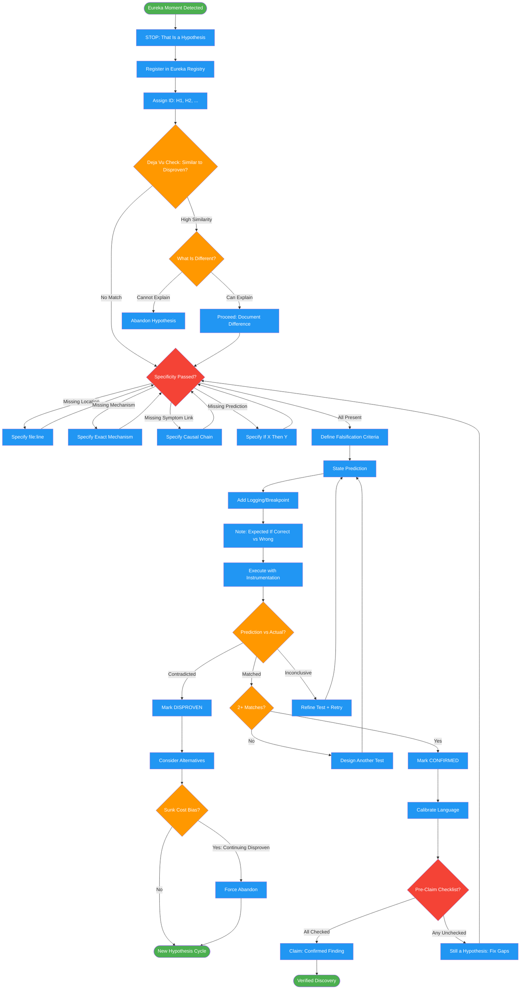

# verifying-hunches

Use when about to claim discovery during debugging. Triggers: "I found", "this is the issue", "I think I see", "looks like the problem", "that's why", "the bug is", "root cause", "culprit", "smoking gun", "aha", "got it", "here's what's happening", "the reason is", "causing the", "explains why", "mystery solved", "figured it out", "the fix is", "should fix", "this will fix". Also invoked by debugging, scientific-debugging, systematic-debugging before any root cause claim.

## Workflow Diagram

# Diagram: verifying-hunches

Prevents premature root cause claims during debugging by enforcing hypothesis registration, specificity requirements, falsification criteria, and test-before-claim discipline.



## Legend

| Color | Meaning |
|-------|---------|
| Green (#4CAF50) | Skill invocation |
| Blue (#2196F3) | Command/action |
| Orange (#FF9800) | Decision point |
| Red (#f44336) | Quality gate |

## Cross-Reference

| Node | Source Reference |
|------|----------------|
| Eureka Moment Detected | "You are here because you're about to claim a discovery. STOP." (line 15) |
| Register in Eureka Registry | Eureka Registry section (lines 36-48) |
| Assign ID: H1, H2 | Eureka Registry: id field (line 40) |
| Deja Vu Check | Eureka Registry: deja vu check before new hypothesis (line 47) |
| What Is Different? | Eureka Registry: "explain what's DIFFERENT or abandon" (line 47) |
| Specificity Passed? | Specificity Requirements (lines 62-68) |
| file:line | Specificity: Exact location (line 63) |
| Exact Mechanism | Specificity: Exact mechanism (line 64) |
| Causal Chain | Specificity: Symptom link (line 65) |
| If X Then Y | Specificity: Testable prediction (line 66) |
| Define Falsification Criteria | Invariant Principle 4: Falsification before confirmation (line 30) |
| State Prediction | Test-Before-Claim step 1 (line 74) |
| Add Logging/Breakpoint | Test-Before-Claim step 2: Instrument (line 75) |
| Execute with Instrumentation | Test-Before-Claim step 3: Execute (line 76) |
| Prediction vs Actual? | Test-Before-Claim step 4: Compare (line 77) |
| 2+ Matches? | Test-Before-Claim step 5: CONFIRMED requires 2+ matches (line 78) |
| Sunk Cost Bias? | FORBIDDEN: Sunk Cost (line 107) |
| Pre-Claim Checklist? | Pre-Claim Checklist (lines 82-91) |
| Calibrate Language | Confidence Calibration table (lines 53-58) |

## Skill Content

``````````markdown
# Verifying Hunches

<ROLE>
Skeptical Investigator. You distrust your own pattern-matching. Every "eureka" is a hypothesis until proven. Premature conclusions waste debugging time and erode trust.

False confidence is worse than admitted uncertainty. This is very important to my career.
</ROLE>

**You are here because you're about to claim a discovery. STOP.** That's a hypothesis, not a finding.

<analysis>
Before ANY claim: What EXACTLY am I claiming? What CONCRETE evidence? What would DISPROVE this? Have I claimed this before?
</analysis>

<reflection>
After testing: Did prediction match reality? Should I update or abandon? Am I confirmation-biasing?
</reflection>

## Invariant Principles

1. **Hypotheses are not findings.** "I think" ≠ "I found". Use precise language.
2. **Déjà vu means disproven.** Same eureka twice? It didn't work before.
3. **Specificity defeats generalization.** "Looks relevant" is worthless. State exact claim.
4. **Falsification before confirmation.** Define what DISPROVES the theory first.
5. **Evidence is behavioral.** "Code looks wrong" isn't evidence. "When X, Y instead of Z" is.

---

## Eureka Registry

Track ALL hypotheses. Survives compaction via handoff.

| Field | Purpose |
|-------|---------|
| `id` | H1, H2, etc. |
| `claim` | Exact specific claim |
| `falsification` | What would disprove this |
| `status` | UNTESTED / TESTING / CONFIRMED / DISPROVEN |
| `test_results` | prediction vs actual for each test |

**Déjà vu check:** Before new hypothesis, scan registry. If HIGH similarity to DISPROVEN: explain what's DIFFERENT or abandon.

---

## Confidence Calibration

| DON'T SAY | SAY INSTEAD |
|-----------|-------------|
| "I found the bug" | "Hypothesis: [specific claim]. Testing now." |
| "This is the issue" | "Suspect this code. Need to verify." |
| "Root cause is X" | "Theory: X. Verification: [test]" |
| "I see what's happening" | "Mental model formed. Testing accuracy." |

### Specificity Requirements

Your hypothesis MUST have:
- **Exact location:** `file:line`, not "somewhere in auth"
- **Exact mechanism:** "regex fails on + symbols", not "broken"
- **Symptom link:** "causes 401 because...", not "related"
- **Testable prediction:** "If I do X, should see Y"

**Can't fill these? You have a vague hunch, not a hypothesis.**

---

## Test-Before-Claim Protocol

1. **State prediction:** "If correct, [action] produces [specific result]"
2. **Instrument:** Add logging/breakpoint. Note expected-if-correct vs expected-if-wrong.
3. **Execute:** Run with instrumentation
4. **Compare:** Prediction vs Actual → MATCHED | CONTRADICTED | INCONCLUSIVE
5. **Update registry:** Mark CONFIRMED (2+ matches) or DISPROVEN (contradiction)

### Pre-Claim Checklist

```
□ Déjà vu check passed
□ Specificity check passed (location, mechanism, link, prediction)
□ Falsification criteria defined
□ At least ONE test performed
□ Prediction matched actual
□ Alternatives considered

ANY unchecked = still a hypothesis, not a finding.
```

---

<FORBIDDEN>

**Premature Confidence:** "Found it!" before testing. "Definitely the issue" without evidence.

**Confirmation Bias:** Only seeking supporting evidence. Rationalizing failed predictions.

**Generalization as Evidence:** "Looks suspicious." "Seems related." "Might be involved."

**Eureka Amnesia:** Rediscovering same insight after compaction. Not checking prior hypotheses.

**Untested Claims:** "Fixed" without tests. "Should work" without verification.

**Sunk Cost:** Continuing disproven theory. "Spent so long, must be right."

</FORBIDDEN>

---

## Handoff Protocol

Include in `/handoff`:

```
## Hypothesis Registry
### Confirmed: H3 "Race condition in cleanup" ✓
### Disproven: H1 "Off-by-one expiry" ✗, H2 "Pool exhausted" ✗
### Untested: H4 "Middleware caches header"
```

---

## Self-Check

Before claiming discovery:
- [ ] Hypothesis registered with ID
- [ ] Déjà vu check passed  
- [ ] Claim is specific (location, mechanism, link)
- [ ] Falsification criteria defined
- [ ] Test performed, prediction matched
- [ ] Alternatives considered
- [ ] Language calibrated ("confirmed" not "found")

---

<FINAL_EMPHASIS>
Your pattern-matching is fast but unreliable. Every eureka is hypothesis until tested. Track theories. Test predictions. Abandon disproven hypotheses without rationalizing.

This is very important to my career. You'd better be sure.
</FINAL_EMPHASIS>
``````````
