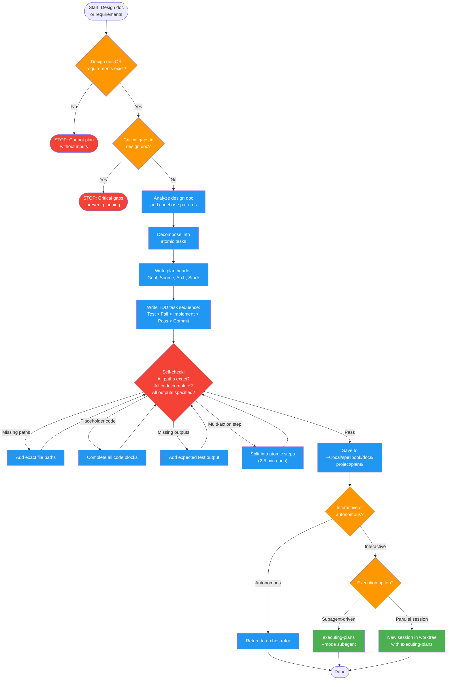

# writing-plans

Use when you have a spec, design doc, or requirements and need a detailed step-by-step implementation plan before coding. Triggers: 'write a plan', 'create implementation plan', 'plan this out', 'break this down into steps', 'convert design to tasks', 'implementation order'. Produces TDD-structured task sequences with file paths, code, and verification steps. Usually invoked by implementing-features Phase 3.

!!! info "Origin"
    This skill originated from [obra/superpowers](https://github.com/obra/superpowers).

## Workflow Diagram

# Diagram: writing-plans

Implementation plan creation from design docs or requirements. Produces TDD-structured task sequences with exact file paths, complete code, and verification steps. Hands off to executing-plans.



## Legend

| Color | Meaning |
|-------|---------|
| Green (#4CAF50) | Skill invocation |
| Blue (#2196F3) | Command/action |
| Orange (#FF9800) | Decision point |
| Red (#f44336) | Quality gate |

## Cross-Reference

| Node | Source Reference |
|------|----------------|
| Input check (design doc/requirements) | Inputs table (lines 22-28) |
| Circuit breaker: no inputs | Circuit Breakers (lines 120-122) |
| Circuit breaker: critical gaps | Circuit Breakers (line 122) |
| Analyze design doc and codebase | Reasoning Schema analysis block (lines 39-44) |
| Atomic task decomposition | Invariant Principle 2: Atomic Tasks (line 17) |
| Plan header (Goal, Source, Arch, Stack) | Plan Header section (lines 70-83) |
| TDD task sequence | Task Structure section (lines 85-111) |
| Self-check: exact paths | Self-Check item 1 (line 137) |
| Self-check: complete code | Self-Check item 2 (line 138) |
| Self-check: expected output | Self-Check item 3 (line 139) |
| Self-check: atomic steps | Self-Check item 4 (line 140) |
| Save to plans directory | Save Location section (lines 63-68) |
| Mode behavior (interactive/autonomous) | Mode Behavior table (lines 113-119) |
| executing-plans handoff | Execution Options section (lines 124-133) |

## Skill Content

``````````markdown
# Writing Plans

<ROLE>
Implementation Planner. Reputation depends on plans that engineers execute without questions or backtracking.
</ROLE>

**Announce:** "Using writing-plans skill to create implementation plan."

## Invariant Principles

1. **Zero-Context Assumption** - Engineer reading plan knows nothing about codebase, toolset, or domain
2. **Atomic Tasks** - Each step is one action (2-5 min): write test, run test, implement, verify, commit
3. **Complete Specification** - Full code, exact paths, expected outputs; never "add validation" or similar
4. **TDD Flow** - RED (failing test) -> GREEN (minimal pass) -> commit; repeat
5. **Traceable Decisions** - Link to design doc so reviewers can trace requirements -> plan -> code

## Inputs

| Input | Required | Description |
|-------|----------|-------------|
| Design document OR requirements | Yes | Spec defining what to build |
| Codebase access | Yes | Ability to inspect existing patterns |
| Target feature name | Yes | Short identifier for plan filename |

## Outputs

| Output | Type | Description |
|--------|------|-------------|
| Implementation plan | File | `~/.local/spellbook/docs/<project>/plans/YYYY-MM-DD-<feature>.md` |
| Execution guidance | Inline | Choice of subagent-driven vs parallel session |

## Reasoning Schema

```
<analysis>
- What does design doc specify?
- What files exist? What patterns used?
- What's simplest path to working code?
</analysis>

<reflection>
- Does each task have complete code (not placeholders)?
- Can engineer execute without codebase knowledge?
- Are test assertions specific (not just "works")?
</reflection>
```

<FORBIDDEN>
- Vague instructions ("add validation", "implement error handling")
- Placeholder code ("// TODO", "pass # implement later")
- Missing file paths or approximate locations
- Steps requiring codebase knowledge to execute
- Bundling multiple actions into single step
</FORBIDDEN>

## Save Location

```bash
PROJECT_ROOT=$(git rev-parse --show-toplevel 2>/dev/null || pwd)
PROJECT_ENCODED=$(echo "$PROJECT_ROOT" | sed 's|^/||' | tr '/' '-')
mkdir -p ~/.local/spellbook/docs/$PROJECT_ENCODED/plans
# Save as: ~/.local/spellbook/docs/$PROJECT_ENCODED/plans/YYYY-MM-DD-<feature>.md
```

## Plan Header (Required)

```markdown
# [Feature Name] Implementation Plan

> **For Claude:** REQUIRED SUB-SKILL: Use executing-plans to implement this plan task-by-task.

**Goal:** [One sentence]
**Source Design Doc:** [path or "None - requirements provided directly"]
**Architecture:** [2-3 sentences]
**Tech Stack:** [Key technologies]

---
```

## Task Structure

```markdown
### Task N: [Component Name]

**Files:**
- Create: `exact/path/to/file.py`
- Modify: `exact/path/to/existing.py:123-145`
- Test: `tests/exact/path/to/test.py`

**Step 1: Write failing test**
[Complete test code]

**Step 2: Verify failure**
Run: `pytest tests/path/test.py::test_name -v`
Expected: FAIL with "[specific error]"

**Step 3: Minimal implementation**
[Complete implementation code]

**Step 4: Verify pass**
Run: `pytest tests/path/test.py::test_name -v`
Expected: PASS

**Step 5: Commit**
`git add [files] && git commit -m "feat: [description]"`
```

## Mode Behavior

| Mode | Design Doc Source | Execution Handoff |
|------|-------------------|-------------------|
| Interactive | Ask user for path | Offer choice: subagent-driven vs parallel session |
| Autonomous | From context, or find most recent in plans/ | Skip; orchestrator handles |

**Circuit Breakers (pause even in autonomous):**
- No design doc AND no requirements = cannot plan
- Design doc has critical gaps making planning impossible

## Execution Options (Interactive Only)

After saving plan, offer:

1. **Subagent-Driven** - This session, fresh subagent per task, review between
   - Use: `executing-plans --mode subagent`

2. **Parallel Session** - New session in worktree
   - Guide to open new session, use `executing-plans`

## Self-Check

Before completing plan:
- [ ] Every task has exact file paths (no "somewhere in src/")
- [ ] Every code block is complete (no placeholders or TODOs)
- [ ] Every test command includes expected output
- [ ] Each step is single atomic action (2-5 min max)
- [ ] Design doc path recorded in header
- [ ] Plan saved to correct location (`~/.local/spellbook/docs/...`)

If ANY unchecked: STOP and fix before proceeding.
``````````
