# writing-skills

Use when creating new skills, editing existing skills, or verifying skills work before deployment

!!! info "Origin"
    This skill originated from [obra/superpowers](https://github.com/obra/superpowers).

## Workflow Diagram

# Diagram: writing-skills

TDD-driven skill creation workflow using RED-GREEN-REFACTOR cycle. Enforces baseline failure documentation before writing, verification after writing, and loophole closure through rationalization tables.

```mermaid
flowchart TD
    Start([Start: Skill purpose\n+ failing scenario]) --> ClassifyType{"Classify skill type:\nDiscipline / Technique /\nPattern / Reference"}:::decision

    ClassifyType --> PhaseCheck{"Multi-phase?\n(3+ phases)"}:::decision

    PhaseCheck -->|"3+ phases"| ArchDecision["Plan orchestrator +\nphase commands split"]:::command
    PhaseCheck -->|"1-2 phases"| ArchDecision2["Self-contained\nSKILL.md"]:::command

    ArchDecision --> RED
    ArchDecision2 --> RED

    subgraph RED_Phase [RED Phase: Baseline Failure]
        RED["Run pressure scenarios\nWITHOUT skill"]:::command --> Capture["Document baseline\nfailures verbatim"]:::command
        Capture --> RED_Gate{"Failures documented?\nRationalizations captured?"}:::gate
        RED_Gate -->|No| RED
    end

    RED_Gate -->|Yes| GREEN

    subgraph GREEN_Phase [GREEN Phase: Write Skill]
        GREEN["Write minimal SKILL.md\naddressing failures"]:::command --> Schema{"Schema compliant?\nFrontmatter + sections?"}:::decision
        Schema -->|No| FixSchema["Add missing sections:\nOverview, When to Use,\nQuick Ref, Mistakes"]:::command --> Schema
        Schema -->|Yes| CSO{"CSO check:\nDescription = triggers only?\nNo workflow summary?"}:::gate
        CSO -->|Fail| FixDesc["Rewrite description:\ntriggers only"]:::command --> CSO
        CSO -->|Pass| TokenCheck{"Token budget met?\n<500 words core?"}:::decision
        TokenCheck -->|Over| Trim["Reduce tokens:\nremove duplication,\ncross-reference skills"]:::command --> TokenCheck
        TokenCheck -->|Under| Verify
        Verify["Re-run pressure\nscenarios WITH skill"]:::command --> GREEN_Gate{"Behavior changed?"}:::gate
    end

    GREEN_Gate -->|No| GREEN
    GREEN_Gate -->|Yes| REFACTOR

    subgraph REFACTOR_Phase [REFACTOR Phase: Close Loopholes]
        REFACTOR["Identify new\nrationalizations"]:::command --> RatTable["Build rationalization\ntable"]:::command
        RatTable --> CloseFix["Add explicit counters\nto SKILL.md"]:::command
        CloseFix --> ReTest["Re-test with\npressure scenarios"]:::command
        ReTest --> REFACTOR_Gate{"All loopholes closed?\nRationalization table\ncomplete?"}:::gate
        REFACTOR_Gate -->|New loopholes| REFACTOR
    end

    REFACTOR_Gate -->|Pass| SelfCheck

    subgraph FinalCheck [Self-Check]
        SelfCheck{"RED documented?\nGREEN verified?\nDescription triggers-only?\nYAML frontmatter valid?\nSchema complete?\nToken budget met?"}:::gate
        SelfCheck -->|Any unchecked| FixIssues["Fix failing checks"]:::command --> SelfCheck
    end

    SelfCheck -->|All pass| Eval{"Evaluative output?\n(verdicts/scores)"}:::decision

    Eval -->|Yes| Assessment["/design-assessment\nfor evaluation framework"]:::command --> Done([Done: Skill deployed])
    Eval -->|No| Done

    %% Iron Law enforcement
    Start -.->|"Wrote skill\nwithout RED?"| IronLaw([DELETE skill.\nStart over.]):::gate

    classDef skill fill:#4CAF50,color:#fff
    classDef command fill:#2196F3,color:#fff
    classDef decision fill:#FF9800,color:#fff
    classDef gate fill:#f44336,color:#fff
```



## Legend

| Color | Meaning |
|-------|---------|
| Green (#4CAF50) | Skill invocation |
| Blue (#2196F3) | Command/action |
| Orange (#FF9800) | Decision point |
| Red (#f44336) | Quality gate |

## Cross-Reference

| Node | Source Reference |
|------|----------------|
| Classify skill type | Skill Types table (lines 42-48) |
| Multi-phase architecture check | Multi-Phase Skill Architecture section (lines 338-379) |
| RED: Run pressure scenarios | Iron Law (lines 214-231) and RED-GREEN-REFACTOR (lines 233-258) |
| Document baseline failures | Invariant Principle 1 (line 18) |
| GREEN: Write minimal SKILL.md | RED-GREEN-REFACTOR Phase 2 (line 241) |
| Schema compliance check | SKILL.md Schema section (lines 49-89) |
| CSO description check | Claude Search Optimization section (lines 104-117) |
| Token budget check | Token Efficiency section (lines 262-273) |
| Verify behavior changed | RED-GREEN-REFACTOR Phase 2 verification (line 241) |
| REFACTOR: Rationalization table | RED-GREEN-REFACTOR Phase 3 (line 242) |
| Iron Law: delete if untested | Iron Law section (lines 214-231) |
| /design-assessment | Assessment Framework Integration (lines 383-398) |
| Self-check items | Self-Check section (lines 400-413) |
| write-skill-test command dispatch | Dispatch template (lines 244-258) |

## Skill Content

``````````markdown
# Writing Skills

<ROLE>
Skill Architect + TDD Practitioner. Your reputation depends on skills that actually change agent behavior under pressure, not documentation that gets ignored. A skill that agents skip or rationalize around is a failure, regardless of how well-written it appears.
</ROLE>

<analysis>
Skill creation = TDD for documentation. Baseline failure reveals what agents actually need. Writing skills without testing is like writing code without running it.
</analysis>

## Invariant Principles

1. **No Skill Without Failing Test**: Run scenario WITHOUT skill first. Document baseline failures verbatim. Same as code TDD.
2. **Description Triggers, Not Summarizes**: Description = when to load, never workflow summary. Workflow in description causes agents to skip body.
3. **One Excellent Example Beats Many**: Single complete, runnable example in relevant language. You port well.
4. **Keywords Enable Discovery**: Error messages, symptoms, synonyms throughout. Future Claude must FIND this.
5. **Close Every Loophole Explicitly**: Agents rationalize under pressure. Each excuse needs explicit counter.

## Inputs

| Input | Required | Description |
|-------|----------|-------------|
| Skill purpose | Yes | What behavior the skill should instill or technique it should teach |
| Failing scenario | Yes | Documented agent behavior WITHOUT the skill (RED phase) |
| Target location | No | `skills/<name>/SKILL.md` path; defaults to inferring from purpose |

## Outputs

| Output | Type | Description |
|--------|------|-------------|
| SKILL.md | File | Schema-compliant skill at target location |
| Baseline documentation | Inline | Record of agent behavior before skill (RED phase) |
| Verification result | Inline | Confirmation skill changes behavior (GREEN phase) |

## Skill Types

| Type | Purpose | Test Approach | Examples |
|------|---------|---------------|----------|
| Discipline | Enforces rules/requirements | Pressure scenarios, rationalizations | TDD, verify command |
| Technique | Concrete steps to follow | Application + edge cases | condition-based-waiting, root-cause-tracing |
| Pattern | Mental model for problems | Recognition + counter-examples | flatten-with-flags |
| Reference | API docs, guides | Retrieval + gap testing | office docs, library guides |

## SKILL.md Schema

```
skills/<name>/
  SKILL.md              # Required. Main content inline
  supporting-file.*     # Only for heavy reference (100+ lines) or reusable tools
```

**Frontmatter (YAML only):**
```yaml
---
name: skill-name-with-hyphens   # letters, numbers, hyphens only
description: Use when [triggering conditions and symptoms only, NEVER workflow]
---
```

**Required sections:**
```markdown
# Skill Name

## Overview
What is this? Core principle in 1-2 sentences.

## When to Use
- Bullet list with SYMPTOMS and use cases
- When NOT to use
[Small inline flowchart IF decision non-obvious]

## Core Pattern (for techniques/patterns)
Before/after code comparison

## Quick Reference
Table or bullets for scanning common operations

## Implementation
Inline code for simple patterns
Link to file for heavy reference

## Common Mistakes
What goes wrong + fixes
```

## Naming Conventions

| Asset | Pattern | Examples |
|-------|---------|----------|
| Skill | Gerund (-ing) or noun-phrase | debugging, test-driven-development, implementing-features |
| Command | Imperative verb(-noun) | execute-plan, verify, handoff, audit-green-mirage |
| Agent | Noun-role | code-reviewer, fact-checker |

**Principles:**
- Name by what you DO or core insight, not generic category
- `root-cause-tracing` > `debugging-techniques`
- `using-skills` not `skill-usage`

## Claude Search Optimization (CSO)

<CRITICAL>
Description = WHEN to load, NEVER what it does. Workflow in description causes agents to follow description instead of reading skill body.
</CRITICAL>

```yaml
# BAD: Workflow summary - agents skip body
description: Use when executing plans - dispatches subagent per task with code review

# GOOD: Triggers only - forces reading body
description: Use when executing implementation plans with independent tasks
```

**Keyword coverage:**
- Error messages: "Hook timed out", "ENOTEMPTY", "race condition"
- Symptoms: "flaky", "hanging", "zombie", "pollution"
- Synonyms: "timeout/hang/freeze", "cleanup/teardown/afterEach"
- Tools: Actual commands, library names, file types

## Writing Effective Skill Descriptions

The `description` field in SKILL.md frontmatter is the primary mechanism for matching user requests to skills. The LLM reads all descriptions and selects the best match. A poorly written description means the skill never fires when it should, or fires when it shouldn't.

### Description Anatomy

A good description has four parts:

1. **Situation** (1 sentence): When this skill applies
2. **Trigger phrases** (3-10 phrases): Natural language that users actually say
3. **Anti-triggers** (optional): When NOT to use this skill, to disambiguate from overlapping skills
4. **Invocation note** (optional): If primarily invoked by other skills, say so

### The Golden Rule: User Phrasings, Not Abstract Situations

<CRITICAL>
Descriptions must contain the words users actually say, not abstract descriptions of situations.

BAD: "Use when debugging bugs or unexpected behavior"
GOOD: "Use when debugging bugs, test failures, or unexpected behavior. Triggers: 'why isn't this working', 'this is broken', 'getting an error', 'stopped working', 'regression', 'crash', 'flaky test', or when user pastes a stack trace."

The BAD version describes the situation abstractly. The GOOD version includes the actual words users type when they need debugging help. Users say "this is broken" far more often than "I need to debug."
</CRITICAL>

### Checklist for Every Description

- [ ] **Contains 3-10 trigger phrases** in quotes that match how users actually talk
- [ ] **Leads with user intent**, not implementation details or internal workflow jargon
- [ ] **Disambiguates from overlapping skills** with "NOT for" or "For X instead, use Y"
- [ ] **Notes invocation path** if primarily called by other skills ("Also invoked by X")
- [ ] **Avoids being too broad** ("Use when writing code" matches everything) or too narrow ("Use only during Phase 2.1 of the Forged workflow")
- [ ] **No internal jargon** that only spellbook developers would know

### Model Descriptions (from the library)

**Best: `verifying-hunches`** -- Comprehensive trigger list drawn from natural speech:
```
"Use when about to claim discovery during debugging. Triggers: 'I found', 'this is the issue',
'root cause', 'smoking gun', 'aha', 'got it', 'the fix is', 'should fix', 'this will fix'.
Also invoked by debugging before any root cause claim."
```
Why it works: 20+ trigger phrases covering both excited discovery ("aha!", "got it") and confident claims ("root cause", "the fix is"). Notes auto-invocation path. Narrow enough to avoid false positives.

**Best: `implementing-features`** -- Clear scope with anti-triggers:
```
"Use when building, creating, or adding functionality. Triggers: 'implement X', 'build Y',
'add feature Z', 'Would be great to...', 'I want to...', 'We need...'.
NOT for: bug fixes, pure research, or questions about existing code."
```
Why it works: Covers both direct commands ("implement X") and wish-phrasing ("Would be great to..."). The "NOT for" section prevents false matches on debugging or research requests.

**Best: `isolated-testing`** -- Behavioral triggers beyond just words:
```
"Use when testing theories during debugging, or when chaos is detected.
Triggers: 'let me try', 'maybe if I', 'quick test', rapid context switching,
multiple changes without isolation."
```
Why it works: Includes behavioral patterns (rapid context switching, multiple changes without isolation) that the LLM can detect in its own actions, not just user text.

### Common Description Anti-Patterns

| Anti-Pattern | Example | Problem |
|-------------|---------|---------|
| **Abstract-only** | "Use when reviewing code" | No trigger phrases. "Review code" matches but "look at my changes" doesn't. |
| **Jargon-first** | "Use when roundtable returns ITERATE verdict" | Users never say this. Internal workflow trigger with no user-facing phrases. |
| **Too broad** | "Use when writing or modifying code" | Matches every coding task. Will fire constantly as a false positive. |
| **Too narrow** | "Use before design phase only" | Limits to one temporal moment when the skill is useful at many stages. |
| **Implementation detail** | "Modes: --self, --feedback, --give" | Users don't think in flags. They think "review my code" or "I got feedback." |
| **Missing disambiguation** | "Use for code review" | Which of the 4 review skills? No "NOT for" or "instead use" guidance. |

### System-Triggered vs. User-Triggered Skills

Some skills are invoked by system events or other skills, not by users:
- **System-only** (e.g., `reflexion`): Description should state "Invoked by [system/skill], not directly by users"
- **Dual-triggered** (e.g., `tarot-mode`): Description should cover both the system trigger AND user-facing triggers
- **User-only** (e.g., `debugging`): Description should focus entirely on user phrasings

### The Overlap Problem

When multiple skills cover similar territory (e.g., 4 review skills), each description MUST include:
1. What makes THIS skill the right choice
2. When to use a DIFFERENT skill instead

Example for a review skill family:
- `code-review`: "For focused single-pass review. NOT for: heavy multi-phase analysis (use advanced-code-review) or PR triage (use distilling-prs)."
- `advanced-code-review`: "For thorough 5-phase analysis with historical context. NOT for: quick review (use code-review) or PR categorization (use distilling-prs)."
- `distilling-prs`: "For triaging and categorizing PR changes. NOT for: deep code analysis (use advanced-code-review)."

## Iron Law

```
NO SKILL WITHOUT FAILING TEST FIRST
```

<reflection>
This applies to NEW skills AND EDITS to existing skills.

Write skill before testing? Delete it. Start over.
Edit skill without testing? Same violation.

**No exceptions:**
- Not for "simple additions"
- Not for "just adding a section"
- Not for "documentation updates"
- Don't keep untested changes as "reference"
- Don't "adapt" while running tests
- Delete means delete
</reflection>

## RED-GREEN-REFACTOR

The full RED-GREEN-REFACTOR implementation (pressure scenarios, baseline testing, skill writing, loophole closure, rationalization tables, red flags, and creation checklist) is in the `write-skill-test` command. Dispatch a subagent to execute it.

**Phase summary:**

1. **RED** - Run pressure scenarios WITHOUT skill. Document baseline failures and rationalizations verbatim.
2. **GREEN** - Write minimal skill addressing specific baseline failures. Verify compliance with same scenarios.
3. **REFACTOR** - Close new loopholes. Build rationalization table. Re-test until bulletproof.

**Dispatch template:**
```
Task(
  description: "RED-GREEN-REFACTOR skill testing",
  prompt: """
First, invoke the write-skill-test command using the Skill tool.
Then follow its complete workflow.

## Context

Skill purpose: [what the skill should do]
Skill type: [discipline/technique/pattern/reference]
Target location: skills/<name>/SKILL.md
Pressure scenarios to test: [describe scenarios]
"""
)
```

## Token Efficiency

**Targets:**
- Getting-started skills: <150 words
- Frequently-loaded skills: <200 words
- Other skills: <500 words

**Techniques:**
- Reference `--help` instead of documenting all flags
- Cross-reference other skills: `**REQUIRED BACKGROUND:** test-driven-development`
- One excellent example, not multi-language
- No `@` links (force-loads files, burns context)

## File Organization

| Pattern | When | Example |
|---------|------|---------|
| Self-contained | All content fits | `defense-in-depth/SKILL.md` |
| With tool | Reusable code needed | `condition-based-waiting/SKILL.md` + `example.ts` |
| Heavy reference | Reference 100+ lines | `pptx/SKILL.md` + `pptxgenjs.md` + `ooxml.md` |

## Code Examples

**One excellent example beats many mediocre ones.**

Choose most relevant language:
- Testing techniques: TypeScript/JavaScript
- System debugging: Shell/Python
- Data processing: Python

**Good example:** Complete, runnable, well-commented explaining WHY, from real scenario, ready to adapt.

**Don't:** Implement in 5+ languages, create fill-in-the-blank templates, write contrived examples.

## Flowchart Usage

**Use ONLY for:**
- Non-obvious decision points
- Process loops where you might stop too early
- "When to use A vs B" decisions

**Never use for:** Reference material (use tables), Code examples (use markdown), Linear instructions (use numbered lists).

## Anti-Patterns

| Pattern | Why Bad |
|---------|---------|
| Narrative ("In session 2025-10-03, we found...") | Too specific, not reusable |
| Multi-language dilution | Mediocre quality, maintenance burden |
| Code in flowcharts | Can't copy-paste, hard to read |
| Generic labels (helper1, step3) | Labels need semantic meaning |

## Discovery Workflow

How future Claude finds your skill:

1. Encounters problem ("tests are flaky")
2. Finds SKILL (description matches)
3. Scans overview (is this relevant?)
4. Reads patterns (quick reference table)
5. Loads example (only when implementing)

**Optimize for this flow** - searchable terms early and often.

<FORBIDDEN>
- Writing skill without documenting baseline failure first (RED phase skipped)
- Summarizing workflow in description (causes agents to skip body)
- Multiple examples when one excellent example suffices
- Deploying without verification run (GREEN phase skipped)
- Ignoring new rationalizations discovered during testing
- Creating multiple skills in batch without testing each
- Keeping untested changes as "reference"
- Using `@` links that force-load and burn context
- Generic labels without semantic meaning
- Narrative storytelling about specific sessions
</FORBIDDEN>

## Multi-Phase Skill Architecture

Skills with multiple phases face a structural decision: what belongs in the orchestrator SKILL.md versus phase commands invoked by subagents?

**When this applies:**

| Phase Count | Requirement |
|-------------|-------------|
| 1 phase | Exempt. Self-contained SKILL.md is fine. |
| 2 phases | SHOULD separate into orchestrator + commands. |
| 3+ phases | MUST separate. Orchestrator dispatches, commands implement. |

**The Core Rule:** The orchestrator dispatches subagents (Task tool). Subagents invoke phase commands (Skill tool). The orchestrator NEVER invokes phase commands directly into its own context.

**Content Split:**

| Orchestrator SKILL.md | Phase Commands |
|----------------------|----------------|
| Phase sequence and transitions | All phase implementation logic |
| Dispatch templates per phase | Scoring formulas and rubrics |
| Shared data structures (referenced by 2+ phases) | Discovery wizards and prompts |
| Quality gate thresholds | Detailed checklists and protocols |
| Anti-patterns / FORBIDDEN section | Review and verification steps |

**Data structure placement:** If referenced by 2+ phases, define in orchestrator. If referenced by 1 phase only, define in that phase's command.

**Soft target:** ~300 lines for orchestrator SKILL.md. The hard rule is about content types: orchestrators contain coordination logic, never implementation logic.

**Exceptions:**
- Config/setup phases requiring direct user interaction MAY run in orchestrator context
- Error recovery MAY load phase context temporarily to diagnose failures

**Canonical example:** implementing-features uses 5 commands across 6+ phases. The orchestrator defines phase sequence, dispatch templates, and shared data structures. Each phase command (discover, design, execute-plan, etc.) contains its own implementation logic.

**Anti-Patterns:**

| Anti-Pattern | Why It Fails |
|-------------|-------------|
| Orchestrator invokes Skill tool for a phase command | Loads phase logic into orchestrator context, defeating separation |
| Orchestrator embeds phase logic directly | Monolithic file; orchestrator context bloats with implementation detail |
| Subagent prompt duplicates command instructions | Drift between prompt and command; maintenance burden doubles |
| Monolithic SKILL.md exceeding 500 lines with phase implementation | Signal that phase logic should be extracted to commands |

## Assessment Framework Integration

**For skills that produce evaluative output** (verdicts, findings, scores, pass/fail):

1. Run `/design-assessment` with the target type being evaluated
2. Copy relevant sections from the generated framework into the skill:
   - **Dimensions table** for evaluation criteria
   - **Severity levels** for finding classification
   - **Finding schema** for output structure
   - **Verdict logic** for decision rules
3. Reference the vocabulary consistently throughout the skill

**Benefits:**
- Consistent vocabulary across evaluative skills (CRITICAL/HIGH/MEDIUM/LOW/NIT)
- Standardized finding schemas enable cross-skill comparison
- Clear verdict logic prevents ambiguous outcomes

**Example skills with evaluative output:** code-review, auditing-green-mirage, fact-checking, reviewing-design-docs

## Self-Check

Before completing:
- [ ] RED phase documented: baseline agent behavior captured verbatim
- [ ] GREEN phase verified: skill changes behavior in re-run
- [ ] Description starts "Use when..." and contains only triggers
- [ ] YAML frontmatter has `name` and `description`
- [ ] Schema elements present: Overview, When to Use, Quick Reference, Common Mistakes
- [ ] Token budget met: <500 words core instructions
- [ ] Multi-phase architecture: 3+ phase skills separate orchestrator from phase commands
- [ ] No workflow summary in description
- [ ] Rationalization table built (for discipline skills)

If ANY unchecked: STOP and fix before declaring complete.

<FINAL_EMPHASIS>
Creating skills IS TDD for process documentation. Same Iron Law: No skill without failing test first. Same cycle: RED (baseline) → GREEN (write skill) → REFACTOR (close loopholes). If you follow TDD for code, follow it for skills. Untested skills are untested code - they will break in production.

**REQUIRED BACKGROUND:** Understand test-driven-development skill before using this skill.
</FINAL_EMPHASIS>
``````````
