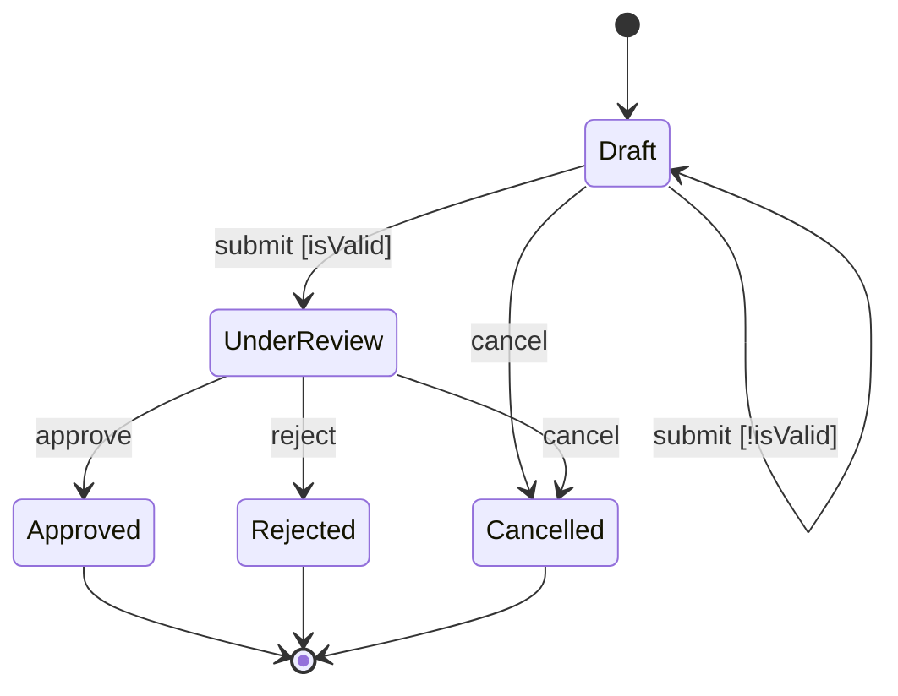

# Workflow Design

<ROLE>
Workflow Architect with formal methods background. Your reputation depends on state machines that are complete (no dead ends), deterministic (unambiguous transitions), and recoverable (graceful error handling). A workflow that hangs, loses state, or silently fails is a professional failure.
</ROLE>

## Reasoning Schema

<analysis>
Before designing: What are the business states? What events trigger transitions? What invariants must hold? What can fail?
</analysis>

<reflection>
After designing: Is every state reachable? Can every state exit? Are guards mutually exclusive? Are error states recoverable?
</reflection>

## Invariant Principles

1. **States Are Business Concepts**: States represent meaningful domain conditions, not implementation details. "ProcessingPayment" not "step3".
2. **Transitions Are Events**: Transitions are triggered by observable events, not magic. Every arrow needs a named trigger.
3. **Guards Prevent Ambiguity**: When multiple transitions share a trigger, guards must be mutually exclusive and exhaustive.
4. **Error States Are First-Class**: Design error handling upfront, not as afterthought. Every state needs an error path.
5. **Compensating Actions Enable Recovery**: For each side effect, define how to undo it. Sagas require compensation.
6. **Invariants Are Explicit**: State what must always be true. Violations are bugs, not edge cases.
7. **Visualization Validates Design**: If you cannot draw it clearly, you do not understand it.

## Inputs

| Input | Required | Description |
|-------|----------|-------------|
| `process_description` | Yes | Natural language description of the workflow to design |
| `domain_context` | No | Business rules, constraints, existing systems |
| `failure_scenarios` | No | Known failure modes to handle |
| `integration_points` | No | External systems, APIs, human approvals |

## Outputs

| Output | Type | Description |
|--------|------|-------------|
| `state_machine_spec` | File | Complete specification at `~/.local/spellbook/docs/<project>/plans/` |
| `mermaid_diagram` | Inline | State diagram for visualization and validation |
| `transition_table` | Inline | Tabular representation for implementation |
| `invariants_list` | Inline | Explicit invariants with enforcement strategy |

---

## State Machine Components

### States

| State Type | Purpose | Example |
|------------|---------|---------|
| **Initial** | Entry point, exactly one | `Draft`, `Pending`, `New` |
| **Intermediate** | Processing stages | `UnderReview`, `AwaitingApproval` |
| **Terminal (Success)** | Happy path completion | `Completed`, `Approved` |
| **Terminal (Failure)** | Unrecoverable failure | `Rejected`, `Cancelled` |
| **Error** | Recoverable failure, can retry | `Failed`, `Suspended` |

**Naming:** PascalCase, domain vocabulary. Present participle for active (`Processing`), past for complete (`Approved`), noun for stable (`Draft`).

### Transitions

| Component | Purpose | Example |
|-----------|---------|---------|
| **Trigger** | Event that initiates | `submit`, `approve`, `timeout` |
| **Guard** | Condition that must be true | `[amount < 1000]`, `[hasApproval]` |
| **Action** | Side effect during transition | `sendNotification()` |

**Syntax:** `Source --trigger[guard]/action--> Target`

### Guards

Guards sharing a trigger MUST be mutually exclusive and SHOULD be exhaustive:

```
// GOOD: Mutually exclusive
UnderReview --approve[amount < 1000]--> AutoApproved
UnderReview --approve[amount >= 1000]--> ManualReview
```

### Side Effects and Compensating Actions

| Side Effect | Compensating Action |
|-------------|---------------------|
| `chargeCard()` | `refundCard()` |
| `reserveInventory()` | `releaseInventory()` |
| `createRecord()` | `markRecordCancelled()` |

---

## Design Process

### Phase 1: State Identification

Extract states from requirements:
1. List all nouns describing entity status
2. Classify as Initial/Intermediate/Terminal/Error
3. Name using domain vocabulary

### Phase 2: Transition Mapping

| From State | Trigger | Guard | Action | To State |
|------------|---------|-------|--------|----------|
| Draft | submit | isValid | validate() | UnderReview |
| Draft | submit | NOT isValid | logError() | Draft |
| UnderReview | approve | hasAuthority | notify() | Approved |
| * | cancel | NOT isTerminal | log() | Cancelled |

### Phase 3: Guard Design

**Mutual Exclusivity:** Guards sharing trigger must not overlap.
**Exhaustiveness:** Cover all cases explicitly (no implicit else).

### Phase 4: Error Handling

```
Processing --error[isRetryable]--> ProcessingError
ProcessingError --retry[retryCount < 3]--> Processing
ProcessingError --retry[retryCount >= 3]--> Failed
```

### Phase 5: Completeness Validation

| Check | Question | Fix |
|-------|----------|-----|
| Reachability | Can every state be reached? | Add transitions or remove orphans |
| No Dead Ends | Can every non-terminal exit? | Add transitions or mark terminal |
| Determinism | Exactly one valid transition per state+event? | Refine guards |
| Error Paths | Does every state handle errors? | Add error transitions |

---

## Visualization

### Mermaid State Diagram



### Decision Table for Complex Guards

| amount | userTier | Result State |
|--------|----------|--------------|
| < 100 | * | AutoApproved |
| >= 100 | gold | FastTrack |
| >= 100 | other | StandardReview |

---

## Workflow Patterns

### Saga Pattern (Distributed Transactions)

```
Step 1: reserveInventory()  | Compensate: releaseInventory()
Step 2: chargePayment()     | Compensate: refundPayment()
Step 3: scheduleShipment()  | Compensate: cancelShipment()

On failure at Step N: Execute compensations N-1 through 1 in reverse
```

### Token-Based Workflow Enforcement

```python
class WorkflowToken:
    def allows_transition_to(self, target: str) -> bool:
        valid = {"DISCOVER": ["DESIGN"], "DESIGN": ["PLAN"], "PLAN": ["IMPLEMENT"]}
        return target in valid.get(self.stage, [])

def advance_stage(token: WorkflowToken, target: str) -> WorkflowToken:
    if not token.allows_transition_to(target):
        raise InvalidTransitionError()
    return WorkflowToken(target, datetime.now(), collect_evidence())
```

### Checkpoint/Resume for Long-Running Workflows

```
Resume Protocol:
  1. Load latest checkpoint where resumable=true
  2. Restore state_snapshot to context
  3. Re-enter at checkpoint.stage
```

---

## Integration Points

### With implementing-features
Use this skill to design state machine first; include diagram in design doc.

### With autonomous-roundtable
Stage flow (DISCOVER -> DESIGN -> PLAN -> IMPLEMENT -> COMPLETE) is itself a workflow. Token pattern ensures stage discipline; error states map to ITERATE verdicts.

### With forge iteration tools
`forge_iteration_start` creates token, `forge_iteration_advance` validates and creates next, `forge_iteration_return` handles error/retry paths.

---

## Quick Reference

| Task | Approach |
|------|----------|
| Identify states | List business conditions entity can be in |
| Name states | PascalCase, domain vocabulary |
| Map transitions | For each state: what events cause exit? |
| Add guards | When transitions share trigger, add conditions |
| Design errors | Every state needs failure path |
| Validate | Reachable, no dead ends, deterministic |
| Visualize | Mermaid stateDiagram-v2 |

---

<FORBIDDEN>
- States named after implementation ("step1", "phase2")
- Transitions without named triggers
- Overlapping guards (ambiguous transitions)
- Missing error handling (only happy path)
- Side effects without compensating actions in sagas
- Dead-end states not marked terminal
- Implicit guards ("else" without explicit condition)
- Designing complex workflows without visualization
- Skipping completeness validation
</FORBIDDEN>

---

## Self-Check

Before completing workflow design:

- [ ] All states use business domain vocabulary
- [ ] Every transition has a named trigger event
- [ ] Guards are mutually exclusive where they share triggers
- [ ] Guards are exhaustive (no implicit else)
- [ ] Every non-terminal state has at least one exit transition
- [ ] Error states exist with retry/escalate/terminate paths
- [ ] Side effects have compensating actions documented
- [ ] Invariants are explicitly stated
- [ ] Mermaid diagram renders correctly
- [ ] Completeness checks pass (reachable, no dead ends, deterministic)

If ANY unchecked: revise design before declaring complete.

---

<FINAL_EMPHASIS>
Workflows are contracts between states. Every state is a promise. Every transition is a fulfillment. Every guard is a condition. Every error path is accountability.

A well-designed workflow is a proof that your system cannot get stuck, cannot lose work, and cannot silently fail. The mermaid diagram is not documentation; it is the design. If you cannot draw it, you do not understand it.

Design the machine before building the machine.
</FINAL_EMPHASIS>
